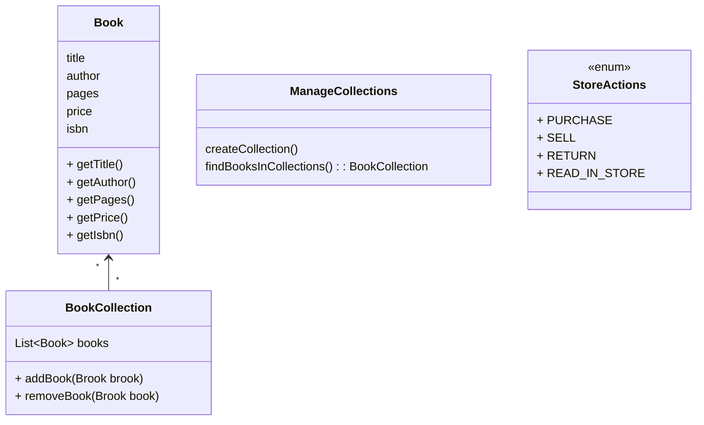

```mermaid
classDiagram
    Book "*" <-- "*" BookCollection

    class Book {
        title
        author
        pages
        price
        isbn
        + getTitle()
        + getAuthor()
        + getPages()
        + getPrice()
        + getIsbn()
    }

    class BookCollection {
        List~Book~ books
        + addBook(Brook brook)
        + removeBook(Brook book)
    }

    class ManageCollections {
        createCollection()
        findBooksInCollections() : BookCollection
    }

    class StoreActions {
        <<enum>>
        + PURCHASE
        + SELL
        + RETURN
        + READ_IN_STORE
    }

```

### Brainstorm on Tests
* Book
  * Test all the gets, setters if i have them
  * BookCollections
    * addBook
    * addNull book
    * add the same book?
  

  
